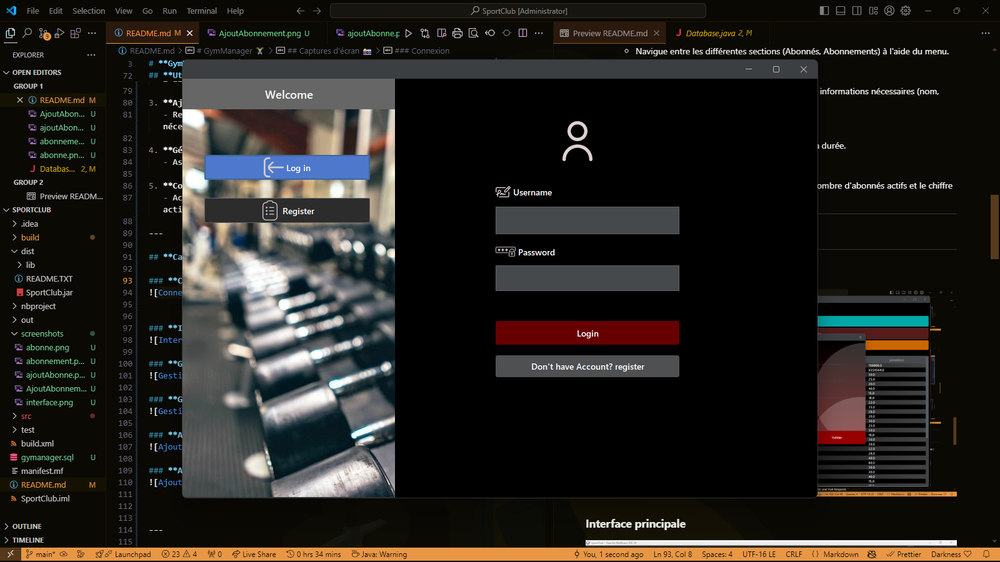
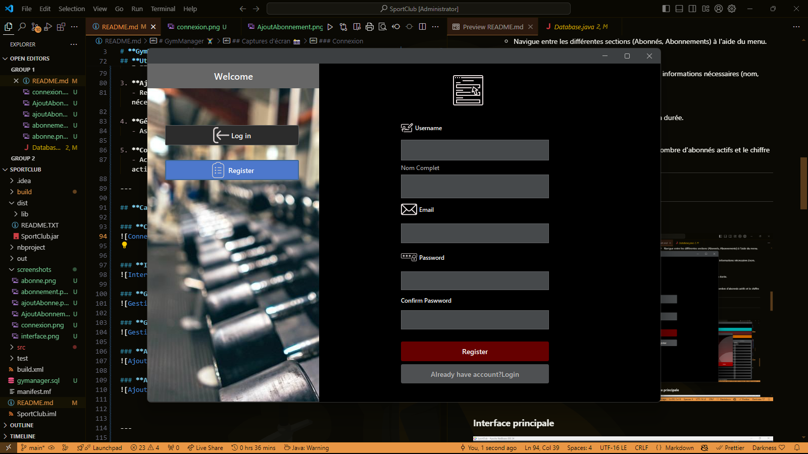
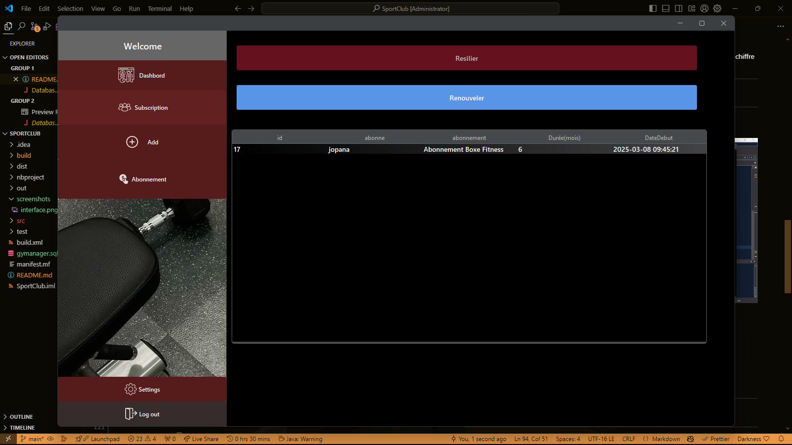
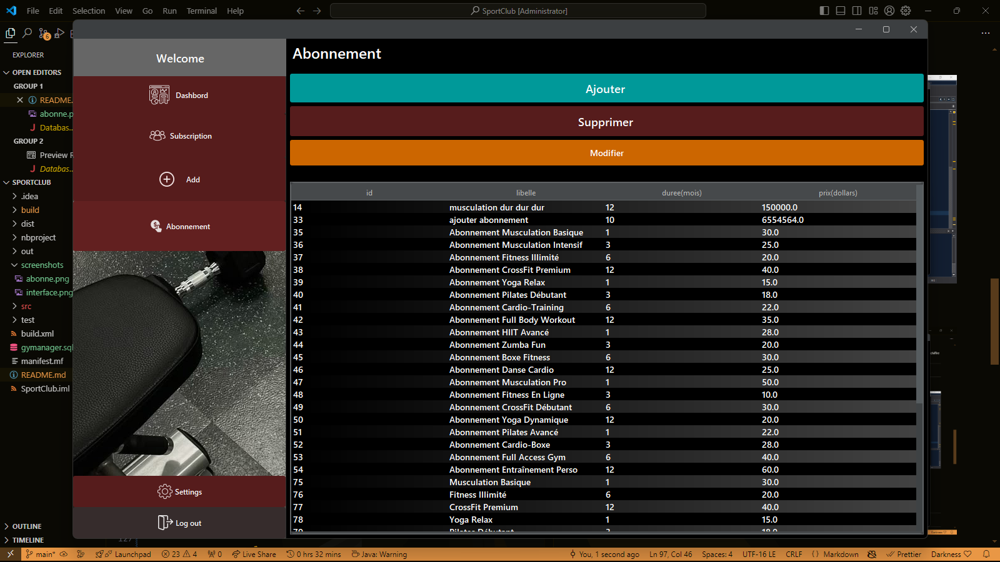
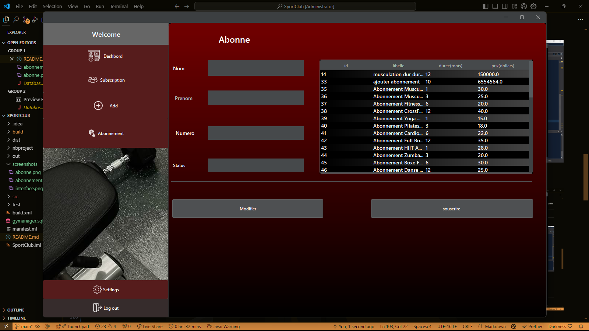
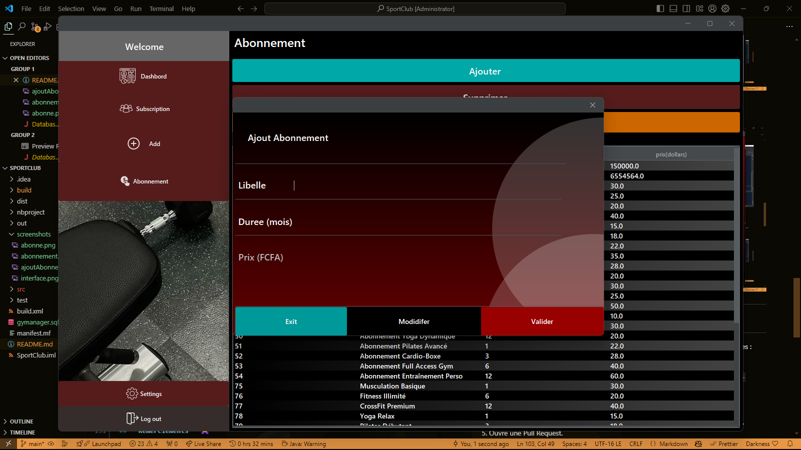

# **GymManager** 🏋️‍♂️

**GymManager** est une application Java de gestion de salle de sport conçue pour simplifier la gestion des abonnés, des abonnements et des activités. Cette application permet aux administrateurs de suivre les membres, de gérer les souscriptions et de superviser les activités de la salle de sport de manière efficace.

---

## **Fonctionnalités principales** 

- **Gestion des abonnés** :
  - Ajouter, modifier et supprimer des abonnés.
  - Consulter les détails des abonnés (nom, prénom, statut, etc.).
  - Rechercher des abonnés par nom, prénom ou ID.

- **Gestion des abonnements** :
  - Créer, modifier et supprimer des abonnements.
  - Associer des abonnements à des abonnés.
  - Suivre la durée et le statut des abonnements.


- **Statistiques et rapports** :
  - Afficher le nombre d'abonnés actifs.
  - Calculer le chiffre d'affaires mensuel.


- **Interface utilisateur intuitive** :
  - Interface graphique conviviale développée avec **Java Swing**.
  - Navigation facile entre les différentes sections.

---

## **Technologies utilisées** 

- **Langage** : Java
- **Base de données** : MySQL
- **Interface graphique** : Java Swing
- **Outils de développement** : IntelliJ IDEA, Eclipse, ou tout autre IDE Java


## **Installation et configuration** ⚙️

### **Prérequis**
- Java JDK 11 ou supérieur
- MySQL Server
- Un IDE Java (IntelliJ IDEA, Eclipse, etc.)

### **Étapes d'installation**
1. **Cloner le dépôt** :
   ```bash
   git clone https://github.com/ton-utilisateur/GymManager.git
   cd GymManager
   ```

2. **Configurer la base de données** :
   - Crée une base de données MySQL nommée `gymmanager`.
   - Importe le fichier SQL fourni (`gymanager.sql`) pour créer les tables nécessaires.

3. **Configurer les paramètres de connexion** :
   - Modifie le fichier `src/DAO/Database.java` pour y ajouter les informations de connexion à la base de données :
     ```properties
     JDBC_DRIVER=jdbc:mysql://localhost:3306/gymmanager
     USER =ton_utilisateur
     PASS=ton_mot_de_passe
     ```

4. **Compiler et exécuter le projet** :
   - Utilise ton IDE pour compiler et exécuter le fichier `Main.java`.

---

## **Utilisation** 

1. **Lance l'application** :
   - Exécute `Main.java` pour démarrer l'application.

2. **Interface principale** :
   - Navigue entre les différentes sections (Abonnés, Abonnements) à l'aide du menu.

3. **Ajouter un abonné** :
   - Remplis le formulaire d'ajout d'abonné avec les informations nécessaires (nom, prénom, statut, etc.).

4. **Gérer les abonnements** :
   - Associe un abonnement à un abonné et suivi sa durée.

5. **Consulter les statistiques** :
   - Accède à la section "Statistiques" pour voir le nombre d'abonnés actifs et le chiffre d'affaires mensuel.

---

## **Captures d'écran** 📸

### **Connexion** 


### **Ajout nouveau admin** 



### **Interface principale**


### **Gestion des abonnés**


### **Gestion des abonnements**


### **Ajout abonnés** 


### **Ajout abonnement** 



---

## **Contribuer** 🤝

Les contributions sont les bienvenues :) ! Si tu souhaites contribuer au projet, suis ces étapes :

1. Fork le projet.
2. Crée une branche pour ta fonctionnalité (`git checkout -b feature/nouvelle-fonctionnalité`).
3. Commit tes changements (`git commit -m 'Ajouter une nouvelle fonctionnalité'`).
4. Push vers la branche (`git push origin feature/nouvelle-fonctionnalité`).
5. Ouvre une Pull Request.

---

## **Auteur** 👤

- **Joan** - [@Mrjojono](https://github.com/Mrjojono)

---


**GymManager** est un projet open source. N'hésite pas à l'utiliser, le modifier et le partager ! 

---

N'oublie pas de remplacer les infos dans le fichier Database.java et  les informations correspondant à ton projet. 😊

Toute contributions est  la  bienvenue.